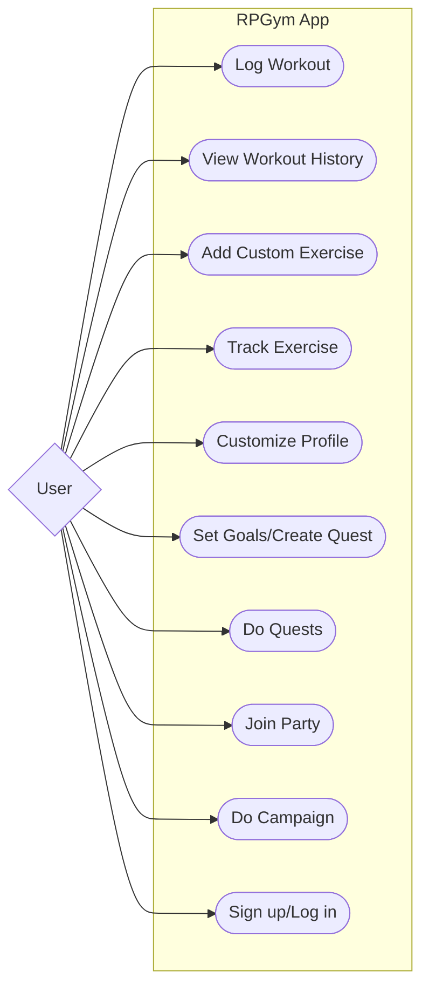
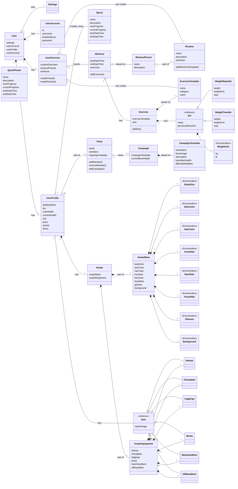
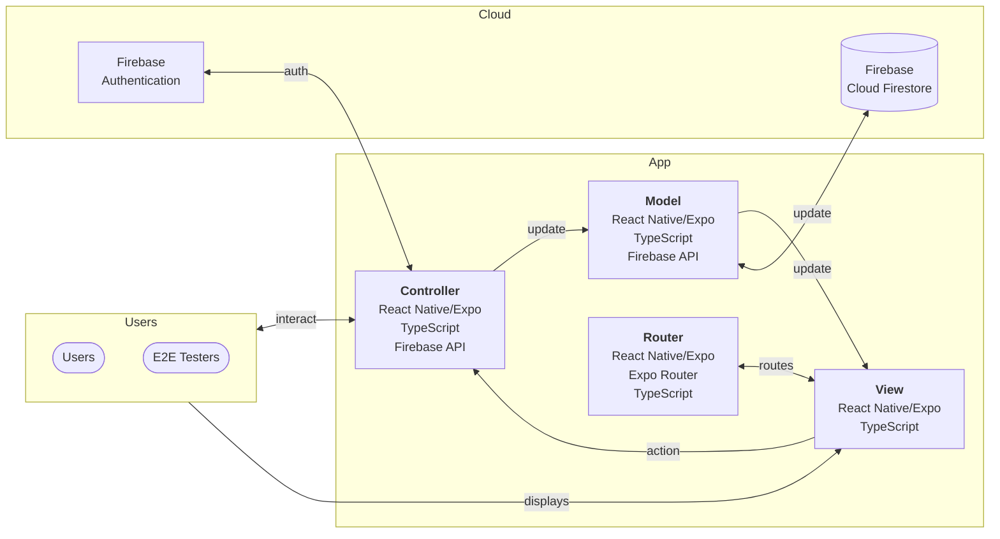

# Software Design

## Design Approach

We use a mix of the top-down and bottom-up design approaches, where the design of the top-most levels is determined first. The design of these top layers is documented below.

## Use Case

## Object Oriented Domain Model

## Software Architecture

### Model-View-Controller

We use the Model-View-Controller (MVC) design pattern to separate presentation code and logic code, in order to make the codebase easier to test and maintain.
